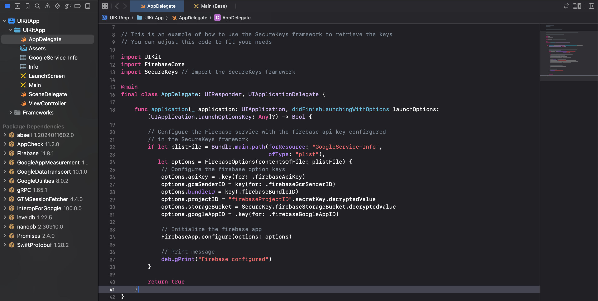

# UIKit app with Firebase + SecureKeys framework

This is a simple UIKit app that uses Firebase and SecureKeys framework.

# Setup

As first step, if you don't have a Firebase project, create one at [Firebase Console](https://console.firebase.google.com/).

Then, download the `GoogleService-Info.plist` file and add it to the `UIKitApp` folder.

Next, you need to remove the `API_KEY`, `GCM_SENDER_ID`, `BUNDLE_ID`, `PROJECT_ID`, `STORAGE_BUCKET` and `GOOGLE_APP_ID` keys from the `Info.plist` file and add them to the Keychain.

> [!IMPORTANT]
> These removed keys should be added to the Keychain using the `secure-keys` or any other service name defined by the `SECURE_KEYS_IDENTIFIER` environment variable, you can see more details about it in the [SecureKeys documentation](/README.md#from-keychain).

```diff
<?xml version="1.0" encoding="UTF-8"?>
<!DOCTYPE plist PUBLIC "-//Apple//DTD PLIST 1.0//EN" "http://www.apple.com/DTDs/PropertyList-1.0.dtd">
<plist version="1.0">
<dict>
-	<key>API_KEY</key>
-	<string>YOUR_API_KEY_VALUE</string>
-	<key>GCM_SENDER_ID</key>
-	<string>YOUR_GCM_SENDER_ID_VALUE</string>
	<key>PLIST_VERSION</key>
	<string>1</string>
-	<key>BUNDLE_ID</key>
-	<string>YOUR_BUNDLE_ID_VALUE</string>
-	<key>PROJECT_ID</key>
-	<string>YOUR_PROJECT_ID_VALUE</string>
-	<key>STORAGE_BUCKET</key>
-	<string>YOUR_STORAGE_BUCKET_VALUE</string>
	<key>IS_ADS_ENABLED</key>
	<false></false>
	<key>IS_ANALYTICS_ENABLED</key>
	<false></false>
	<key>IS_APPINVITE_ENABLED</key>
	<true></true>
	<key>IS_GCM_ENABLED</key>
	<true></true>
	<key>IS_SIGNIN_ENABLED</key>
	<true></true>
-	<key>GOOGLE_APP_ID</key>
-	<string>YOUR_GOOGLE_APP_ID_VALUE</string>
</dict>
</plist>
```

**If needed**, you can remove the existing keys from the Keychain using the `security` command.

```bash
security delete-generic-password -a "secure-keys" -s "secure-keys"
```

Now, you can add the key identifier to the Keychain using the `security` command.

This command will add the keys to the Keychain using the `secure-keys` service name.

```bash
security add-generic-password -a "secure-keys" -s "secure-keys" -w "firebaseApiKey,firebaseGcmSenderID,firebaseBundleID,firebaseProjectID,firebaseStorageBucket,firebaseGoogleAppID"
```

Then, you can add the key values to the Keychain using the `security` command.

```bash
security add-generic-password -a "secure-keys" -s "firebaseApiKey" -w "your-api-key"

security add-generic-password -a "secure-keys" -s "firebaseGcmSenderID" -w "your-gcm-sender-id"

security add-generic-password -a "secure-keys" -s "firebaseBundleID" -w "your-bundle-id"

security add-generic-password -a "secure-keys" -s "firebaseProjectID" -w "your-project-id"

security add-generic-password -a "secure-keys" -s "firebaseStorageBucket" -w "your-storage-bucket"

security add-generic-password -a "secure-keys" -s "firebaseGoogleAppID" -w "your-google-app-id"
```

# Usage

Before to run the app, you need to run the `secure-keys` command:

```bash
secure-keys --verbose
```

Now, you can open the `UIKitApp.xcodeproj` file and run the app.

> [!IMPORTANT]
> This command should be ran in the same directory where the `UIKitApp.xcodeproj` file is located.

```bash
xed .
```

You can visit the `AppDelegate.swift` file to see the Firebase initialization.



Later you can follow the steps described in the [SecureKeys documentation](/README.md#how-to-install-the-securekeysxcframework-in-the-ios-project) to run the app.

To ensure that the app is working properly, you can compile or run the app from the Xcode.


